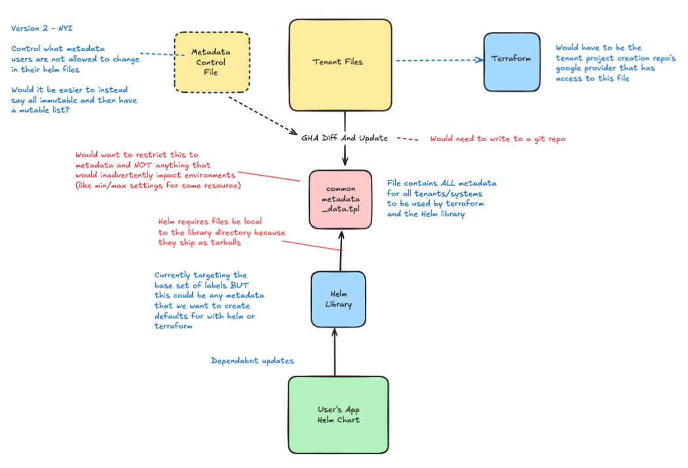

# Mozcloud Shared Data Library

A Helm library chart for sharing common configuration data across multiple charts.

## Overview



## Available Functions

### Basic Data Access
- `mozcloud-shared-data-lib.getDynamicData` - Get specific data by app code and key
- `mozcloud-shared-data-lib.commonData` - Access raw common data

### Data Merging
- `mozcloud-shared-data-lib.smartMergeData` - Merge shared, chart, and custom data with precedence
- `mozcloud-shared-data-lib.mergeDataPreferLocal` - Local values override shared
- `mozcloud-shared-data-lib.mergeDataPreferShared` - Shared values override local

## Quick Example

```yaml
# Get labels for an app
{{- include "mozcloud-shared-data-lib.getDynamicData" (dict "context" . "appCode" "jameslabel" "dataKey" "labels") | nindent 4 }}

# Smart merge with precedence: shared < chart < values
{{- include "mozcloud-shared-data-lib.smartMergeData" (dict "context" . "appCode" "jameslabel" "dataKey" "labels" "chartDataTemplate" "jameslabel.labels" "customData" .Values.labels) | nindent 8 }}
```